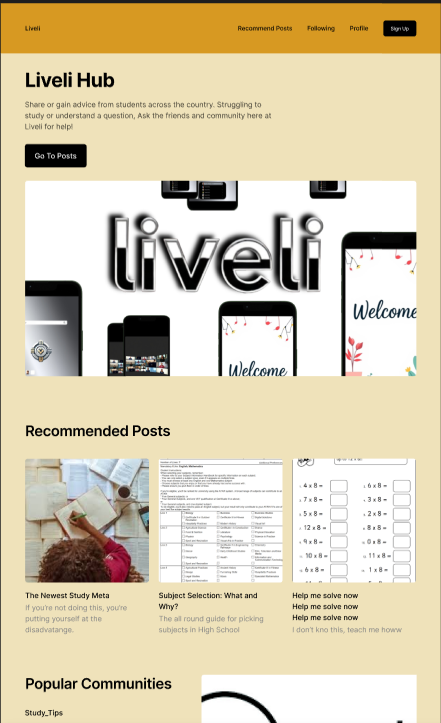
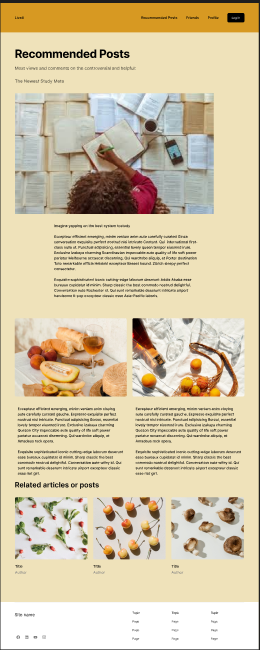

## Description of App Construction
The design of the orignal app intended to allow user to share stories and images of the experience and use the resources to create material that assist people to focus on work topics. The design changed to an advice forum with similar systems but removing the extra features like the *podcast AI generator*. I plan to accomodate for laptop and resolutions upto *1920x1080*

## Requirements for Build
**Functional**
1. The Users should be able to login into the website and have their own profile
2. Users should be able to record their experience 
3. The website should be sustain their recorded experience for future visits

**Non-Functional**
1. The perfomance should be load quickly in 1 second or under
2. The application should be easy to use and cater towards user experience
3. The website should reliably respond to user actions    

## Initial Design 

**Hub :**
The initial visuals of the website are important so I choose a fluid gold and blue colour scheme intended to evoke creativity with functions like login, friends and the main function, review post all in clear view when entering the site. The point of this layout is to cater to the user with everything they would want to browse and use on our website easily accessible from the moment they load in.

**Recommended Posts :**
Once someone decised to begin browsing, they are brought to a site with the top recommended posts either tailored to your account if you're are logged in or general posts most people have seen. The design makes the most recommended post big with a apt description underneath it to grab the users attention with a clip of the full post. Beneath will be less popular posts with less space dedicated to each one with the last row being smaller posts. 

**Login :**
gfjzQWUIEGVB