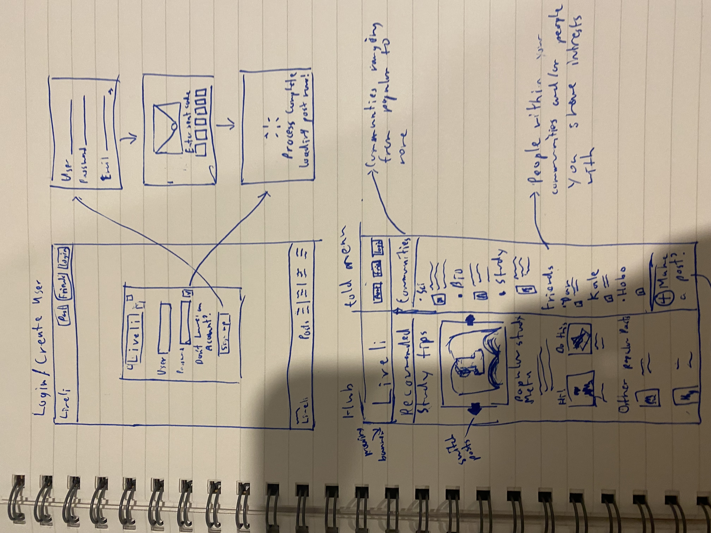
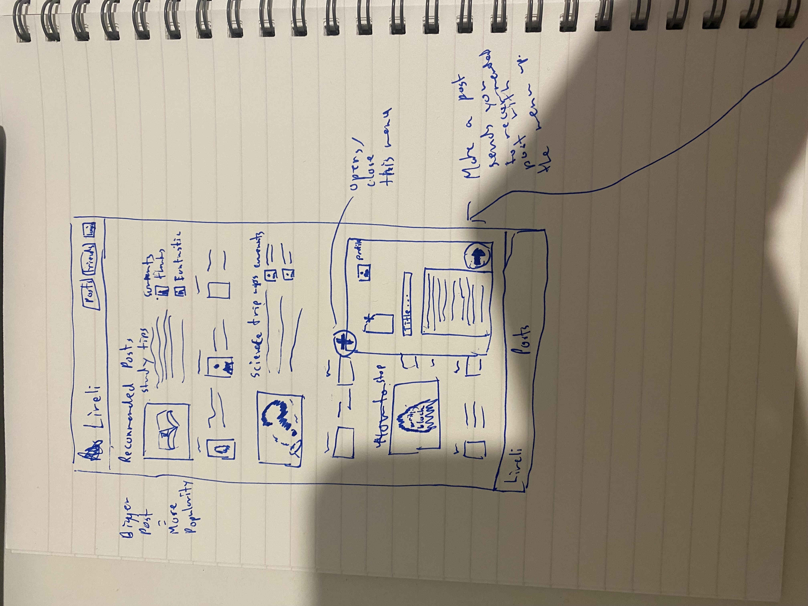
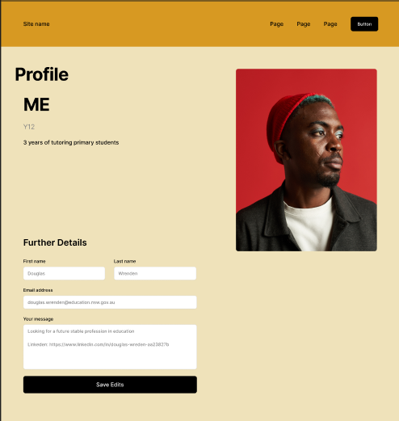
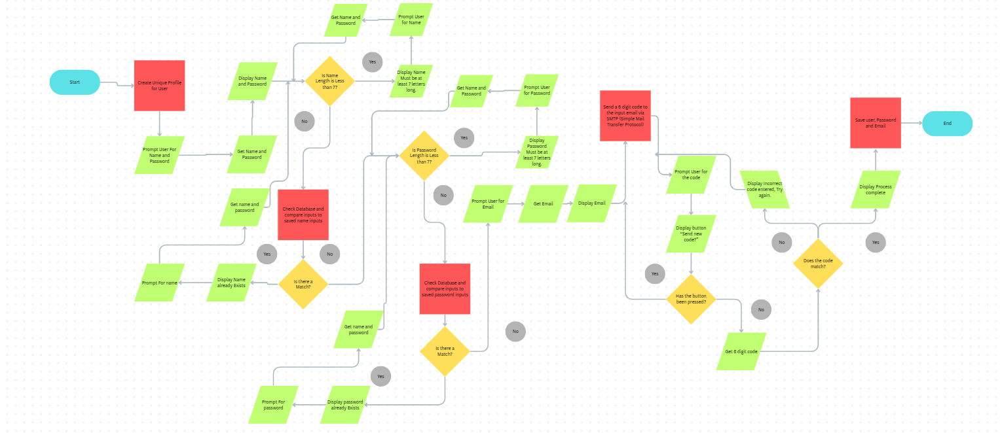
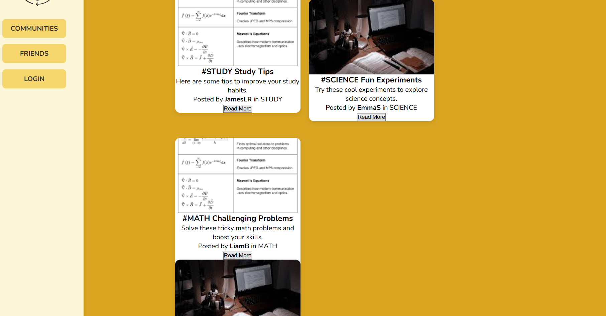
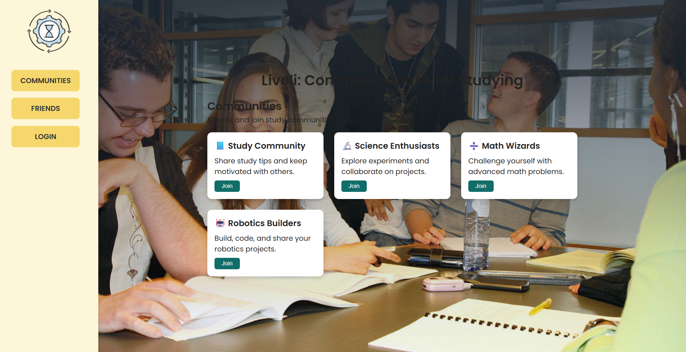
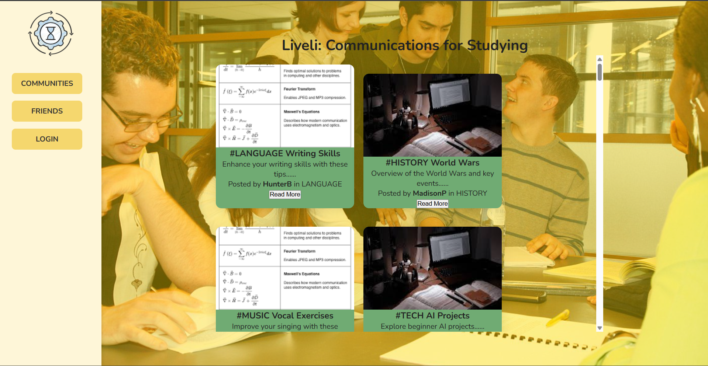

## Description of App Construction
The design of the orignal app intended to allow user to share stories and images of the experience and use the resources to create material that assist people to focus on work topics. The design changed to an advice forum with similar systems but removing the extra features like the *podcast AI generator*. I plan to accomodate for laptop and resolutions upto *1920x1080*

## Requirements for Build
**Functional**
1. The Users should be able to login into the website and have their own profile
2. Users should be able to record their experience 
3. The website should be sustain their recorded experience for future visits

**Non-Functional**
1. The perfomance should be load quickly in 1 second or under
2. The application should be easy to use and cater towards user experience
3. The website should reliably respond to user actions    


## Initial Design : Sketch



This sketch demonstrates the original ideas of security and making all functions easily accesible from the get go. The login/sign up process should be a fluid process asking the most relevant information relating to security. The system would also use 2 factor authentication to strengthen security and allow account recovery. Either way through signing up or logging in, you will get brought to a window design to allow the web page to load before entering the hub. This design will be simple and have few images as the user most likely won't spend most of their time on the login menu, instead in the hub. The hub design is changed to have a moving banner and drop down menu for the communities, friends and profile edits. this version of recommended post will have a limited few post compare to the actual page and clicking anywhere within the recommended posts section will bring you to the page/post you were looking at. Clicking the "make a post function" brings you to the recommended post section with the system for creating a post -refer to 2nd sketch- open. This design in purely based on having the user move onto the post instead of having them browse communities or potential friends first to provide the purpose of this website as quick as possible. 




This sketch shows big and small posts repeating to comb through the users intrests and uses the design to evoke a certain pattern when browsing. This design includes the process to upload a post, requiring a logged in account to post. The posting system would work similar to the design used in gmail and can be linked to a certain community by adding a tag in the title e.g #STUDY. This design is supposed to emphasis the more relevant posts whilst not excluding the smaller topics. The moving creation post system is so you can read and refer to other posts with precise detail whilst creating the account, leading to a easier user experience.

## Initial Design : Figma


**Hub :**
The initial visuals of the website are important so I choose a fluid yellow, orange and white colour scheme intended to evoke creativity with functions like login, friends and the main function, review post all in clear view when entering the site. The point of this layout is to cater to the user with everything they would want to browse and use on our website easily accessible from the moment they load in.


**Recommended Posts :**
Once someone decised to begin browsing, they are brought to a site with the top recommended posts either tailored to your account if you're are logged in or general posts most people have seen. The design makes the most recommended post big with a apt description underneath it to grab the users attention with a clip of the full post. Beneath will be less popular posts with less space dedicated to each one with the last row being smaller posts. 



**Profile :**
Assuming the user is logged in, the profile will appear in which the user can edit their bio, username and additional detail someone might want to know about the user such as experience, year group and other academic achievements. This is to make the user more attached/invested into a site whilst allowing the user to express themselves to others and make connections with others more easily. The design doesn't affect much except carrying the same motif of calm, creativity evoking colour scheme and the placement of the more important to least important profile additions ranging for the top to the bottom for convience.

| Design Choice | Choice/Reasoning |
|---------------|------------------|
|Colour Palette| I chose a Light Yellow, Orange and white colour scheme as it evokes calm and creative emotions to assist people in imagining situations in which they can relate to the post they readand can be commonly associated with purity, meant to reflect the nature of young children strive for education.
| Typography | I chose a relatively big, dark font Raleway Bold for Liveli due to its easy to read nature and a big siaze for late night scrolls when light is heavily diminished, ensureing the reader can still leisurely interpret the words. 
| Image/ Icon Choice | My image is Liveli in big bold letters with phones utlising the liveli website on their phone. This design is to show how the user will be alongside other users in a connected communications platform and the logo is a grey and silver design meant to replicate a guild insignia. This is to create familiarity between users and help them understand that they're communicating with people having similar problems during their studies.

## Profile Creation Algorithm



**Test Cases**

1. 
|Test Function| Reasoning and Results|
|-------------|----------------------|
|Test Case ID| TC0001|
|Test Case Name| Creating a Profile|
|Preconditions| Have a Valid Email|
|Test Steps|Enter Valid username and password, Enter Email, Enter the Emailed code|
|Expected Result| The Database should save the info and record login info for future use|
|Actual Result| N/A |
|Pass/Fail| N/A |
|Priority| High |
2. 
|Test Function| Reasoning and Results|
|-------------|----------------------|
|Test Case ID| TC0002|
|Test Case Name| Entering a username that already exists|
|Preconditions| An Account must already exist that has the same username as the inputted name|
|Test Steps|Enter the username of already existing account|
|Expected Result| The Database should reject the username and re prompt the user for a name|
|Actual Result| N/A |
|Pass/Fail| N/A |
|Priority| High |

## SQL Table and Data Generation

I Made 4 tables linking to Users, Post, Friends and Communities

Link go here:

**Queries**

1. Count the amount of Post in a Community
```sql
SELECT c.CommunityName, COUNT(p.PostID) AS TotalPosts
FROM Communities c
LEFT JOIN Posts p ON c.CommunityID = p.CommunityID
GROUP BY c.CommunityName;
```
2. List all friends of a user
```sql
SELECT u.Username AS FriendName
FROM Friends f
JOIN Users u ON f.FriendUserID = u.UserID
WHERE f.UserID = 1;   
```
3. Find all post by a specific user
```sql
SELECT p.Title, p.Content, p.CreatedAt
FROM Posts p
JOIN Users u ON p.UserID = u.UserID
WHERE u.Username = 'JamesLR';
```
4. Find Users who haven't posted
```sql
SELECT u.Username
FROM Users u
LEFT JOIN Posts p ON u.UserID = p.UserID
WHERE p.PostID IS NULL;
```
5. Recommended Posts/ Popular Communities
```sql
SELECT p.Title, p.Content, u.Username, c.CommunityName
FROM Posts p
JOIN Users u ON p.UserID = u.UserID
JOIN Communities c ON p.CommunityID = c.CommunityID
WHERE c.CommunityName IN (
    SELECT CommunityName
    FROM Communities
    WHERE CommunityID IN (
        SELECT CommunityID
        FROM Posts
        GROUP BY CommunityID
        ORDER BY COUNT(PostID) DESC
        LIMIT 1
    )
);
```
## Webpage Creation

Using Html and Css, website construction began with touch and coding the following:
 1. *Static/Css/Style.css* to add detail and design to my webstie to match the intended colour scheme devised weeks ago.
 2. *Templates/Partial/Menu.html* to edit the design and title of the webpage as liveli and using the following image to represent the site. This will stay consitent throughout the webpage journey.
 
 3. *Templates/* Also contains Htmls such as index.html, Posts.html, Communities.html all vital to create each seperate page and add interactivity to each one. 

## Initial Creation and Bugs

Once all files and directories were created, I began by following the example code provide in the doc **SET UP:HTML and CSS** to create the example home web page. I styled it using my css file to have a side bar with the buttons and the logo which would be permantly affixed in the postion no mater how far I scrolled down the page. I then switch the table so it would pull from my Posts table to display data in into the cards. However only 4 cards on screen at a time. I also made it so post would have either equations or study group images. I also added a feature that when a users clicks on a post, it will bring them to a page of that specfic post. 


Issues caused by this is that the cards would frequently overlap, causing the information on post to be blocked as well as the button the open it. 

This was resolved by clarifying the distance each card must maintain from one another in style.css. I also fixed the issue that sealed the home page to only 4 posts by correcting a mistake in the index.html pulling minimal data and added a scroll function to allow users to browse the post easily. After that I added a communities page where I added a description and title and allowed users to join communities and get recommended post made by users in that community. Issues arose when gathering the data from the database but were fix quickly by re arranging the database table to fit with the pre existing code and present data. 

After establishing the home and communities pages, I implemented the login and friends system to allow personalized user interactions. This involved creating user accounts in the database, handling login sessions, and allowing users to add friends to their lists. During testing, several issues were discovered. Initially, when a user logged in, the session data was not properly retained across pages. This caused the sidebar to always display the login button even when a user was signed in. The issue was caused by inconsistent session variable names or templates checking for variables that did not exist. To fix this, I standardized the session variables and ensured that all templates correctly checked for a user being logged in. The sidebar now correctly displays logout and friends options when a user is signed in.



Another issue occurred on the friends page, which occasionally threw a template error related to an unexpected end of the template. This was caused by missing endblock tags in the friends template, which prevented the page from rendering correctly. I reviewed all templates and added the necessary closing tags for all blocks, which resolved the rendering errors and allowed the friends list to display properly. There was also a problem with adding friends, as users could add the same friend multiple times, creating duplicate entries in the database. This was fixed by adding a check to verify whether a friendship already existed before inserting a new record. If the friend was already in the user’s list, a warning message is displayed instead.

When interacting with posts and communities, clicking on an item sometimes resulted in an error where the URL could not be built. This occurred because the templates were referencing incorrect attribute names instead of the actual database column names. By updating the templates to use the correct column names, the correct URLs were generated, and the error was resolved. There were also issues with database queries returning no results or causing errors due to mismatched column names. To fix this, I updated the database tables to match the application code, ensuring that all queries could retrieve and display the correct data.



In addition to backend issues, there were several layout and styling problems. Post cards occasionally overlapped when they contained images or equations, which blocked the content and buttons. The communities page sometimes displayed misaligned cards due to varying description lengths. These problems were addressed by adjusting the CSS to standardize card heights, margins, and scroll behavior. I also implemented a scrollable container for posts and communities so that the layout remained consistent regardless of the number of items. These adjustments ensured that the application was visually consistent and user interactions were reliable across all pages.

## Lighthouse Report

My light house report for my post and login in pages: 


The Issue regarind my post pages is that the links don't have descriptive links that help the search engine understand them better.


Theres were a few bugs regarding communities and the sigh up doesn't work.
## Instructions regarding the website

1. Open VSCode
2. Load the folder {Flask_PWA_Programming_For_The_Web_Task_Template}
3. Run python main.py in terminal

List of users for sign in.